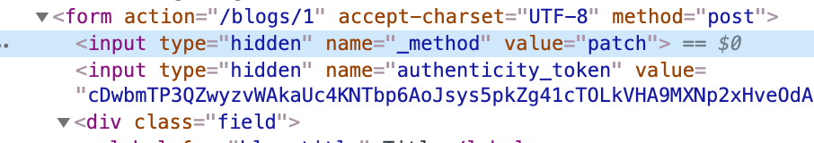

# Railsツアー

`rails`コマンドや`scaffold`で生成されたコードを眺めて、Railsの世界観を身につけようの時間です

## 事前準備

本リポジトリの[トップページにあるREADME](../../README.md)を参考にRuby 2.7系やRails 6.0系、そしてnodeなどのインストールを行っておいてください。

### サンプルアプリケーションの作成

コマンドの詳しい意味などは本編で解説するので、まずは以下のコマンドを実行してRailsアプリケーションを作成します。

`sample` 部分はアプリケーション名です。

```sh
% rails new sample --skip-action-mailer --skip-action-mailbox --skip-action-text --skip-active-storage --skip-action-cable -d postgresql
% cd sample
```

そして、このドキュメントと同じ階層にある[docker-compose.yml](./docker-compose.yml)を上記のアプリケーションと同じ階層（この場合はsampleディレクトリの中）にコピーし、`docker-compose up`を実行してDocker上にDBを立ち上げます。

```sh
% docker-compose up
```

Docker上のDBに接続するため、RailsアプリケーションのDB接続情報を変更します。
config/database.ymlを編集し、default内にhostやport情報を追記します。

```yml
default: &default
  adapter: postgresql
  encoding: unicode
  # For details on connection pooling, see Rails configuration guide
  # https://guides.rubyonrails.org/configuring.html#database-pooling
  pool: <%= ENV.fetch("RAILS_MAX_THREADS") { 5 } %>
  host: localhost # <-- 追加
  port: 54320     # <-- 追加
  username: root  # <-- 追加
  password: root  # <-- 追加
  :
  :
```

続いて、動作確認もかねてDB上にデータベースを作成します。

```sh
% ./bin/rails db:create
```

その後、次のコマンドでPostgreSQLのターミナルへ接続できれば成功です。

```sh
% ./bin/rails db
Password for user root: # <--- パスワード（今回はroot）を入力する
psql (12.3)
Type "help" for help.

sample_development=# \l sample*
                                  List of databases
        Name        | Owner | Encoding |  Collate   |   Ctype    | Access privileges
--------------------+-------+----------+------------+------------+-------------------
 sample_development | root  | UTF8     | en_US.utf8 | en_US.utf8 |
 sample_test        | root  | UTF8     | en_US.utf8 | en_US.utf8 |
(2 rows)
sample_development=# \q
```

正しくDBにアクセスし、作成したデータベースの一覧を参照できれば事前準備は完了です。

## `railsコマンド`を触ってみよう

すでに事前準備でも少し触れていますたが、Railsで扱うコマンド群は`bin`ディレクトリに集約されています。
通常、Bundlerでgemライブラリを扱っている場合は`bundle exec rails`のようにbundlerを使ったコマンドの実行を行いますが、Railsでは`bundle exec`を利用せず、すぐに扱えるようなラッパースクリプトを用意しています。それがbinディレクトリ以下にあるコマンドで、一般的にこのようなラッパースクリプトはbinstubと呼ばれます。

Rails 6.0では次のようなbinstubが用意されています。もっともよく利用するのはrailsコマンドでしょう。

- ProTip:過去のRailsでよく使うコマンドはrailsコマンドとrakeコマンドに分かれていましたが、近年のRailsではrailsコマンドからrakeコマンドで利用するタスクを実行できるようになったため、rakeコマンドを直接扱うことは少ないでしょう
- ProTip:開発時によく使うコマンドをbinstubに集約すると、binディレクトリを見るだけでこのプロジェクトがどのようなコマンドを利用しているかわかるようになるため途中から参画したメンバーにも理解しやすくなるでしょう（たとえばrubocopなど）。

```sh
% ls -1FA bin
bundle*
rails*
rake*
setup*
spring*
webpack*
webpack-dev-server*
yarn*
```

それではrailsコマンドを触ってみましょう。`rails -h`でヘルプを出力してみます。

```sh
% ./bin/rails -h
The most common rails commands are:
 generate     Generate new code (short-cut alias: "g")
 console      Start the Rails console (short-cut alias: "c")
 server       Start the Rails server (short-cut alias: "s")
 test         Run tests except system tests (short-cut alias: "t")
 test:system  Run system tests
 dbconsole    Start a console for the database specified in config/database.yml
              (short-cut alias: "db")
  :
  webpacker:verify_install
  webpacker:yarn_install
  yarn:install
  zeitwerk:check
```

- ProTip:秘匿情報を扱うタスクとして`secret`と`credentials`が存在しますが、`secret`はRails 5.1までの機能なので、Rails 5.1にこだわりがなければ覚える必要はありません

ここで出力される内容のうち、最初に表示されるgenerateやconsoleはRails開発において基本となるコマンド群です。とくにconsoleやserverは日常的に利用するコマンドです。

一方、メインとなるコマンド以降の出力内容は旧来のrakeコマンドで利用してきたものです。引き続きrakeコマンドを使って実行することも可能ですが、「使い分けをすることが初学者へ混乱を招く」ということでrailsコマンドから利用できるようになった経緯があるため、特別な理由がなければrailsコマンドを使いましょう。

- 🙆‍♀️ `./bin/ralis stats`
- 🙅‍♀️ `./bin/rake stats`

Rakeタスク由来のコマンドのうち、よく利用するのは以下のコマンドでしょう。

- `db:xxxx` DBのテーブル情報などを更新する
  - db:create
  - db:migrate
  - db:version
- `routes` ルーティング情報を出力する
- `runner` ワンライナーや単発のスクリプトなどを実行する

## scaffoldでRailsの開発を体験してみよう

scaffoldとは、rails generateで使用できる、あるテーブルに対してCURD操作を行うWebアプリケーションのソースコード一式を生成するコマンドです。
Railsの仕組みをざっくり確認したい場合や15分でブログを作りたい場合などに利用します。

- ProTip:`./bin/rails generate`ではmodelのみ、controllerのみといったコンポーネント単位でのジェネレートもできます

### scaffoldでファイルを生成する

まずは次のコードを実行してscaffoldを実行します。scaffoldを実行する際はテーブル名に続いてカラムを指定します。`カラム名:DBの型`を指定しますが、DBの型を省略した場合はstring（255文字までの文字列）型となります。

```sh
% ./bin/rails g scaffold blog title
% ./bin/rails g model entry name body:text blog:references
```

この例ではscaffoldで作成したblogに対してリレーションを持つentryというテーブルも作成します。entryは単にテーブルと対応するモデルクラスだけ必要なので`rails g model`としています。

- ProTips: generateやconsole、serverといったrailsのコマンドはそれぞれ `g` , `c` , `s` などと省略できます。

これで必要なファイルが作成できました。この時、DBのテーブル作成などは各DBごとの方言を吸収したDSLで記述したファイルとして、`db/migrate`以下に生成されます。

```sh
% ls -1FA db/migrate
20200802142731_create_blogs.rb
20200802142740_create_entries.rb
```

```ruby
# cat db/migrate/20200802142731_create_blogs.rb
class CreateBlogs < ActiveRecord::Migration[6.0]
  def change
    create_table :blogs do |t|
      t.string :title

      t.timestamps
    end
  end
end
```

これらのファイルをマイグレーションファイルと呼びます。
マイグレーションファイルを実際のDBに適用させるためにはrailsコマンドのdb:migrateを使います。

```sh
% ./bin/rails db:migrate
  :
% ./bin/rails db:migrate:status

database: sample_development

 Status   Migration ID    Migration Name
--------------------------------------------------
   up     20200802142731  Create blogs
   up     20200802142740  Create entries
```

Statusがupと表示されている行はマイグレーションファイルを適用済みであることを表しています。

これでDBの準備ができました。

### scaffoldで生成された機能を画面上で操作する

まず、どのようなURLが生成されているかルーティング情報を確認してみましょう。
出力内容のうち、VerbとURI Patternを見ることでどのようなURLにアクセスすべきかおおよその検討をつけます。

```sh
./bin/rails routes
   Prefix Verb   URI Pattern               Controller#Action
    blogs GET    /blogs(.:format)          blogs#index
          POST   /blogs(.:format)          blogs#create
 new_blog GET    /blogs/new(.:format)      blogs#new
edit_blog GET    /blogs/:id/edit(.:format) blogs#edit
     blog GET    /blogs/:id(.:format)      blogs#show
          PATCH  /blogs/:id(.:format)      blogs#update
          PUT    /blogs/:id(.:format)      blogs#update
          DELETE /blogs/:id(.:format)      blogs#destroy
```

ルーティング情報をイメージしながら、実際にアプリケーションを触ってみます。まずはrails serverを使ってアプリケーションサーバーを起動させます。

```sh
% ./bin/rails s
```

無事に起動したら、まずは http://localhost:3000/blogs へアクセスしましょう。正しくアプリケーションが動いていれば、かっこいいブログ一覧画面が表示されます（初回はデータが一件もないので、「New Blog」のリンクしかありません）。

ここからはしばらく、データの作成や編集、削除などを試してみましょう。この時、デベロッパーツールを表示して、画面遷移時のHTTPメソッドやURLの動きを見ると良いでしょう。

## scaffoldのコードを読んでみよう

scaffoldで生成されたかっこいいブログがどのように動いているか、実際のコードをを見てみましょう。

### ルーティングとコントローラー

再掲となりますが、改めてルーティング情報を確認してみましょう。


```sh
./bin/rails routes
   Prefix Verb   URI Pattern               Controller#Action
    blogs GET    /blogs(.:format)          blogs#index
          POST   /blogs(.:format)          blogs#create
 new_blog GET    /blogs/new(.:format)      blogs#new
edit_blog GET    /blogs/:id/edit(.:format) blogs#edit
     blog GET    /blogs/:id(.:format)      blogs#show
          PATCH  /blogs/:id(.:format)      blogs#update
          PUT    /blogs/:id(.:format)      blogs#update
          DELETE /blogs/:id(.:format)      blogs#destroy
```

かっこいいブログの一覧画面は `/blogs` でアクセスしたことを思い出してください。ブラウザで`/blogs`へアクセスする場合、通常はHTTPのGETメソッドでアクセスしています。そのことを念頭にroutesの結果を見ると、次の行に対応していることがわかります。

```
Prefix Verb   URI Pattern               Controller#Action
 blogs GET    /blogs(.:format)          blogs#index
```

この行の`Controller#Action`に注目しましょう。ここがURLパターンに対応するコントローラーとメソッドです。
具体的に説明すると、`app/controllers/blogs_controller.rb`にある`index`メソッドが呼ばれるということを表しています。

```ruby
class BlogsController < ApplicationController
  before_action :set_blog, only: [:show, :edit, :update, :destroy]

  # GET /blogs
  # GET /blogs.json
  def index
    @blogs = Blog.all
  end
  :
end
```

indexメソッドでは、Blogというモデルクラスを通じてblogsテーブルのレコードを全件取得しています。
このデータをビューテンプレートで出力し、HTMLなどをブラウザに返しています。

続いて、URLとコントローラーを紐付けているルーティングの定義を確認してみます。`config/routes.rb`の内容を見てみましょう。

```ruby
Rails.application.routes.draw do
  resources :blogs
end
```

`resources :blogs`と記述されています。これはRailsが提供するCRUD操作の基本的な7アクションを定義するための記法で、resourcesで定義するアクションのうち、特定のアクションだけ使えるようにする、というようなことも可能です。

`resources`という書き方は数ある定義方法の1つです。より詳しくは[Railsガイドのルーティングの章](https://railsguides.jp/routing.html)を参照してください。

ところで、ここまで読んだ方はRailsらしいルーティングって何？　と思うかもしれません。そのためのヒントをいくつか例示します。

- RailsはRESTの考え方に基づくURL構造を基本としている
- [DHHはどのようにRailsのコントローラを書くのか](https://postd.cc/how-dhh-organizes-his-rails-controllers/)

より単純に書くと、`get /path/controller`のようなプリミティブなルーティングは定義をせず、`resources`や`resource`を使った定義とshowやonlyを組み合わせた制御でルーティングできないか考えるのが良いでしょう。

### コントローラーからビューへ

ルーティングの定義からアクションまでの流れをここまで解説してきました。
次にアクションからテンプレートを探索する流れを追ってみましょう。

先ほどのindexアクションを再掲します。

```ruby
# app/controllers/blogs_controller.rb
def index
  @blogs = Blog.all
end
```

Railsではこれだけの記述から暗黙的に使用するテンプレートを選択してしまいます。
この例の場合は`app/views/blogs/index.html.erb`を参照します。これは、コントローラー名とアクション名から導かれるものです。

- `app/views/コントローラー名/アクション名.html.erb`

テンプレートファイルの末尾の拡張子はテンプレートエンジンの種別を表していて、`erb`以外に`haml`や`jbuilder`などはよく目にするかもしれません。
また、今回の例で`.html`となっている拡張子部分をRailsではformatと呼んでいます。

formatはhtmlであることをデフォルトとして考えますが、URLに拡張子（`/blogs.html`）をつけたり、ヘッダーで指定するなどすることで、任意のformatをリクエストできます。

indexの動作の場合、ビューテンプレートとして`.html.erb`と`.json.jbuilder`が用意されていることがわかると思います。それぞれのテンプレートを見てみましょう。

```html
# app/views/blogs/index.html.erb の一部抜粋
    <% @blogs.each do |blog| %>
      <tr>
        <td><%= blog.title %></td>
        <td><%= link_to 'Show', blog %></td>
        <td><%= link_to 'Edit', edit_blog_path(blog) %></td>
        <td><%= link_to 'Destroy', blog, method: :delete, data: { confirm: 'Are you sure?' } %></td>
      </tr>
    <% end %>
```

```ruby
# app/views/blogs/index.json.jbuilder
json.array! @blogs, partial: "blogs/blog", as: :blog
```

いずれも`@blogs`を参照していることがわかります。これは、コントローラー内で取得したインスタンス変数をテンプレート内から参照しているということです。なお、参照できるのは `@` で始まるインスタンス変数のみであり、メソッド内のローカル変数を共有することはできません。
言い換えればテンプレートとコントローラーはインスタンス変数を共有している、とも言えます。そのため、コントローラー内で不必要にインスタンス変数を扱ってしまうとコントローラーで参照しているかもしれないという懸念が生まれ、メンテナンス性に影響を与えます。

- ProTip:今回のJSONの例では `partial: "blogs/blog"` を使ってblogオブジェクトの中でどの要素を返却するか明示しています
  - こういう対応をせず、カラムにある情報をすべて出すような実装をしてしまうと、本来表に出してはいけない情報を出力してしまう場合があるので、気をつけましょう（たとえば`Blog.all.to_json`で全てのデータをフィルターせず返してしまうような実装は要注意）
  - 事例と思われるもの：userごとのハッシュ化したパスワードとsaltが漏れてしまった例
    - https://jiraffe.co.jp/news/2019/01/31/1321/
    - https://jiraffe.co.jp/news/2019/02/22/1352/

`partial: "blogs/blog"` でblogオブジェクトの要素をフィルタリングしている例

```ruby
# app/views/blogs/_blog.json.jbuilder
json.extract! blog, :id, :title, :created_at, :updated_at
json.url blog_url(blog, format: :json)
```


ここまではindexアクションを元にした暗黙的なテンプレートの選択について流れをみてきました。
しかし、実際のアプリケーションではHTMLとJSONで同じデータ形式を返すだけでは終わらない場合もあります。
そういったformat単位でコントローラー内の処理を変えたい場合はrespond_toを使います。
たとえば、updateアクションなどはformatによってレスポンスを変更しています。また、respond_toとセットである必要はありませんが、renderメソッドを使うことで任意のテンプレートを指定するようなことが可能です。

```ruby
def update
  respond_to do |format|
    if @blog.update(blog_params)
      format.html { redirect_to @blog, notice: 'Blog was successfully updated.' }
      format.json { render :show, status: :ok, location: @blog }
    else
      format.html { render :edit }
      format.json { render json: @blog.errors, status: :unprocessable_entity }
    end
  end
end
```

### ビューとURL

HTMLを描画する際、リンクやformなど、別URLへ遷移することはよくあります。Railsではアプリケーション内の別Pathへアクセスしやすくするためのヘルパーを用意しています。

先ほどのindex.html.erbを再掲します。

```html
      <tr>
        <td><%= blog.title %></td>
        <td><%= link_to 'Show', blog %></td>
        <td><%= link_to 'Edit', edit_blog_path(blog) %></td>
        <td><%= link_to 'Destroy', blog, method: :delete, data: { confirm: 'Are you sure?' } %></td>
      </tr>
```

tdタグ内のlink_toに注目してください。link_toはaタグを生成するためのヘルパーメソッドですが、今回は2つ目のlink_toメソッドで第二引数として利用している値`edit_blog_path(blog)`の解説をします。

`edit_blog_path(blog)`は、実際にレンダリングすると`/blogs/1/edit`のようなパスを生成し、blogsコントローラーのeditアクションへのリンクとなります。
この`edit_blog_path`のような記法はパスやURLヘルパーなどと呼ぶもので、ルーティングで定義したPrefixの値を利用しています。`Prefix+_path`とすることでRailsのアクション向けのパスを生成します。この時、ヘルパーの引数にはURI Patternを構築するために必要なパラメーターを渡す必要があります。

```sh
./bin/rails routes
   Prefix Verb   URI Pattern               Controller#Action
    :
edit_blog GET    /blogs/:id/edit(.:format) blogs#edit
```

URLヘルパーを利用する場合、多くはActiveRecordオブジェクトなどを直接引数に渡すことでパスを構築しますが、`edit_blog_path(id: 1)`のようにルーティングに必要なパラメーターを直接渡すことも可能です。

また、`_path`ではなく`_url`を末尾に追加するヘルパーもあります。`_url`の場合はパス情報だけではなく、httpから始まる完全なURLを返します。

```ruby
# rails cでは`app`経由でpathやurlヘルパーを使うことができます
irb(main):004:0> app.edit_blog_path(blog)
=> "/blogs/1/edit"
irb(main):005:0> app.edit_blog_url(blog)
=> "http://www.example.com/blogs/1/edit"
```

ビューテンプレート向けのヘルパーメソッドはたくさんありますが、URLヘルパーはRailsのルーティングと噛み合わせるための重要なヘルパーなので、忘れないようにしておきましょう。

### フォームとルーティング

ここまでコントローラーからビューへの流れを解説していきましたが、逆にビューからコントローラーへの流れについてもう少し詳しく解説します。
単にaタグでのリンクの場合は指定したパスへGETアクセスするだけですが、データを更新する場合は少し込み入っています。

今回はupdateの例を見てみましょう。updateアクションへ到達するためにはeditアクションで編集画面を表示し、編集画面からformを使ってupdateアクションへアクセスしています。

まずはeditのテンプレートを見てみましょう。

```ruby
# app/views/blogs/edit.html.erb
<h1>Editing Blog</h1>

<%= render 'form', blog: @blog %>

<%= link_to 'Show', @blog %> |
<%= link_to 'Back', blogs_path %>
```

edit.html.erbの中にformタグは見当たりませんね。formタグは共通の部品として切り出しているため、別ファイルを呼び出す形になっています。このような部品単位のテンプレートを部分テンプレートやパーシャルと呼びます。

実際のコードとしては`<%= render 'form', blog: @blog %>`がパーシャルで呼び出している部分です。この場合、`form`というパーシャルを指定していますが、ファイル名の探索としては`_form`を探索します。パーシャルとして利用するテンプレートファイルはファイル名の先頭に`_`を付与させることを覚えておきましょう。

それではformタグの実態を見てみましょう。

```ruby
<%= form_with(model: blog, local: true) do |form| %>
  <% if blog.errors.any? %>
    <div id="error_explanation">
      <h2><%= pluralize(blog.errors.count, "error") %> prohibited this blog from being saved:</h2>

      <ul>
        <% blog.errors.full_messages.each do |message| %>
          <li><%= message %></li>
        <% end %>
      </ul>
    </div>
  <% end %>

  <div class="field">
    <%= form.label :title %>
    <%= form.text_field :title %>
  </div>

  <div class="actions">
    <%= form.submit %>
  </div>
<% end %>
```

Railsではform_withというヘルパーを使ってformタグを生成させます。form_withを使うことでmodelオブジェクトの状態からリクエスト先などを生成しています。

さて、ここでルーティング情報を改めてみましょう。`blogs#update`の行に注目してください。

```sh
./bin/rails routes
   Prefix Verb   URI Pattern               Controller#Action
    blogs GET    /blogs(.:format)          blogs#index
          POST   /blogs(.:format)          blogs#create
 new_blog GET    /blogs/new(.:format)      blogs#new
edit_blog GET    /blogs/:id/edit(.:format) blogs#edit
     blog GET    /blogs/:id(.:format)      blogs#show
          PATCH  /blogs/:id(.:format)      blogs#update
          PUT    /blogs/:id(.:format)      blogs#update
          DELETE /blogs/:id(.:format)      blogs#destroy
```

blogs#updateはPATCHやPUTメソッドでリクエストを送ると定義されています。
しかし、世の中のブラウザの実装としてPATCHメソッドなどを正しく実装されているとは限りません。そのため、RailsではformタグとしてはPOSTで送信しつつ、hiddenパラメーターでPATCHやPUTを使っているということを明示しています。



このような工夫をしてREST的なHTTPの動きと現実の齟齬を吸収しています。
通常アプリケーションを開発しているときはform_withヘルパーを使うことでこういった点については気にせず実装できます。

### モデル

コントローラーで何となく使っていたBlogモデルについて、ソースコードを見てみましょう。

```ruby
# app/models/blog.rb
class Blog < ApplicationRecord
end
```

何もないですね。Blogクラスの親クラスApplicationRecordはActiveRecordクラスを継承した物で、ApplicationRecord自体もほぼ空のクラスです。

```ruby
# app/models/application_record.rb
class ApplicationRecord < ActiveRecord::Base
  self.abstract_class = true
end
```

`ApplicationRecord`はRailsプロジェクトのモデル全体で設定したい内容などを記述するレイヤーのため、特別な事情が出てくるまでは空のまま扱うことになるでしょう。

そして、これらのコードからわかる通り、scaffold時点でモデルクラスにはアプリケーション固有の実装などはありません。ActiveRecord本体の機能があり、Blogというクラス名とテーブルが紐づいているだけの状態です。

そのため、ここではActiveRecordの基本について解説します。

ActiveRecord、つまりRailsにおけるモデルはデザインパターンのActiveRecordパターンを踏襲した、クエリビルダーとORMを内包したモノです。

ActiveRecordはクエリビルダーのため、次のようなwhereメソッドなどでSQLを発行できます。

```sh
# SQLはイメージです
Blog.all # => SELECT "blogs".* FROM "blogs"
Blog.where(id: 1) #=> SELECT "blogs".* FROM "blogs" WHERE "blogs"."id" = 1
```

モデルについて重要なのは1レコードに相当する単一の要素はActiveRecordのインスタンスで表現されますが、whereの戻り値のような複数レコードにまたがる集合は配列風に扱うことができるActiveRecord::Relationというクラスのインスタンスを返すという点です。

ActiveRecord::Relationはデータの集合を表していますが、このオブジェクト自体はレコードの集合ではありません。ActiveRecordでは実際にActiveRecord::Relationの各要素を必要とするまでSQLの実行を遅延するため、ActiveRecord::Relationオブジェクトを扱う時点ではSQLが発行されません。

この動作は実際のコードを見た方がわかりやすいでしょう。たとえば、メソッドチェーンで条件を重ねる場合や、if文で条件を切り替えるような場合でも、都度SQLを発行するわけではありません。

```ruby
# idとtitleをandでつなげたSQLが組み立てられる
# SELECT "blogs".* FROM "blogs" WHERE "blogs"."id" = 10 AND "blogs"."title" = 'foo'
Blog.where(id: 10).where(title: "foo")

# elseの場合は上の例と同じSQLが組み立てられる
# SELECT "blogs".* FROM "blogs" WHERE "blogs"."id" = 10 AND "blogs"."title" = 'foo'
rel = Blog.where(id: 10)
rel = if cond
        rel.where(title: cond)
      else
        rel.where(title: "foo")
      end
rel
```

なお、どうしてもコードの途中でSQLを実行したいというような場合もあります。そう言ったときは`to_a`メソッドなどを呼ぶと言ったテクニックもあります（カジュアルにやるものではありません）。

また、`find`/`find_by`メソッド、あるいは`ret[0]`のようにActiveRecord::Relationから要素を取得した物はActiveRecordのインスタンスです。このオブジェクトはSQLを発行した後の結果であるため、whereなどクエリビルダーに相当するメソッドは利用できません。

- ProTip
  - 関連先のモデル（アソシエーション）を参照する場合、素朴に参照するとN+1が発生してしまいます
    - その場合、SQLレベルでjoinするか、あらかじめ関連先を読み込んでおく必要があります
      - `preload`/`joins`/`includes`/`eager_loads`/`left_joins`あたりをうまく使ってください。複数の関連先を読み込んだり、関連先の関連先を読み込むようにすることもできるので、どのような違いがあるか色々試すと良いでしょう
  - ActiveRecordオブジェクトは重い
    - ActiveRecordは非常に高機能ですが、一方、非常に重いオブジェクトでもあります。そのため、取得するレコードが多い場合はオブジェクトの生成を抑える方法を検討すると良いでしょう。
      - たとえば、単にidの配列が欲しい場合は`select(:id)`ではなく`pluck(:id)`を使う
      - たとえば、whereで数千件取得するのではなく`find_each`を使いある程度の要素単位で扱う

## scaffoldのコードを編集してみよう

ここからはscaffoldで生成されたコードを編集して、少しコードを書いてみましょう。
編集するコード例は[サンプルリポジトリ](https://github.com/sugamasao/basic_rails_sample_code/commits/master)に置いてあるので、最終形をみたい方はそちらをみてください。

今回のRailsツアーで作成したサンプルアプリケーションでは、scaffoldで作成したモデルの他にentryというモデルを作成したことを覚えているでしょうか？

scaffoldで作成しただけでは別モデルとの関連付けは行われていないので、その関連づけを元にRailsアプリケーションを拡張してみましょう。

### モデルの関連付け

Railsではモデル同士の関連付けを実現させるため、`has_many`や`has_one`、`belongs_to`メソッドを使います。

今回の例ではBlogモデルからEntryモデルへ1対多を表現するため、Blogモデル側にhas_manyを指定します。

```ruby
# app/models/blog.rb
class Blog < ApplicationRecord
  # dependent: :destroyをつけると、blog削除時に関連するレコード(entry)も一緒に削除します
  has_many :entries, dependent: :destroy
end
```

こうすると、Blogモデルに関連するentryをentriesという名称で参照できます。

```ruby
Blog.first.entries.each do |entry|
  :
end
```

ここでは1対多の関連を記述しましたが、それ以外に多対多など柔軟に設定する方法があります。より詳しくはRailsガイドの[Active Record の関連付け](https://railsguides.jp/association_basics.html)を参照してください。

この関連を活用して、db/seeds.rbに初期データの投入処理を書いてみましょう。

```ruby
# db/seeds.rb
5.times do |n|
  b = Blog.create(title: "blog #{n}")
  Random.rand(1..4).times do |_n|
  # blogの関連として作成したEntryを追加する
    b.entries << Entry.create(name: "entry #{_n}", body: "あ" * _n)
  end
end
```

seeds.rbに追加したら、`db:seed`を使ってデータを投入してみます。

```sh
% ./bin/rails db:seed
```

とくにエラー出なければ成功です。データを確認してみましょう。

```ruby
irb(main):001:0> Blog.last.entries.count
   (0.7ms)  SELECT sqlite_version(*)
  Blog Load (0.2ms)  SELECT "blogs".* FROM "blogs" ORDER BY "blogs"."id" DESC LIMIT ?  [["LIMIT", 1]]
   (0.2ms)  SELECT COUNT(*) FROM "entries" WHERE "entries"."blog_id" = ?  [["blog_id", 5]]
=> 2
irb(main):002:0> Blog.last.entries
  Blog Load (0.2ms)  SELECT "blogs".* FROM "blogs" ORDER BY "blogs"."id" DESC LIMIT ?  [["LIMIT", 1]]
  Entry Load (0.3ms)  SELECT "entries".* FROM "entries" WHERE "entries"."blog_id" = ? LIMIT ?  [["blog_id", 5], ["LIMIT", 11]]
=> #<ActiveRecord::Associations::CollectionProxy [#<Entry id: 9, name: "entry 0", body: "", blog_id: 5, created_at: "2020-08-16 05:56:36", updated_at: "2020-08-16 05:56:36">, #<Entry id: 10, name: "entry 1", body: "あ", blog_id: 5, created_at: "2020-08-16 05:56:36", updated_at: "2020-08-16 05:56:36">]>
```

### ビューの拡張

blogからentryを参照できるようにしたので、ビューでも表示できるようにしてみましょう。

今回は素朴にindexページにentry要素も表示できるようにしてみます。

https://github.com/sugamasao/basic_rails_sample_code/commit/0378697801fe5b7639726faa1a1b9e0abcd49414

```html
# app/views/blogs/index.html.erb
     <% @blogs.each do |blog| %>
       <tr>
         <td><%= blog.title %></td>
+        <td>
+          <ul>
+            <% blog.entries.each do |entry|%>
+              <li><%= entry.name %> | <%= entry.body %></li>
+            <% end %>
+          </ul>
+        </td>
         <td><%= link_to 'Show', blog %></td>
         <td><%= link_to 'Edit', edit_blog_path(blog) %></td>
         <td><%= link_to 'Destroy', blog, method: :delete, data: { confirm: 'Are you sure?' } %></td>
```

見た目の美しさはともかく、blogに紐づくentryを表示することができるようになりました。
今回の例はかなり単純な構造ですが、多くの場合は関連先の情報を出力する部分を別テンプレートに切り出すと見通しが良くなります。

パーシャルの機能を使って切り出してみましょう。
まずはファイルを新しく作成し、entryの内容を出力している部分を移します。

```ruby
# app/views/blogs/_entry.html.erb
<li><%= entry.name %> | <%= entry.body %></li>
```

次に、元のindex.html.erbから`_entry.html.erb`を読み込むようにします。
renderメソッドのポイントは`partial: テンプレート名`の指定と、localsです。
単純にテンプレートを読み込むだけなら`partial:`を指定せずテンプレート名を指定するだけで動作しますが、`locals`など部分テンプレート向けの機能を有効にするためには`partial:`によるテンプレート名の指定が必要です。

また、`locals`を使うことで、読み込むテンプレート内で使用する変数名を明示します。
`{ entry: entry }`とした場合は`{ _entry.html.erb内で利用する変数名: index.html.erb内で使用している変数名 }`ということを表しています。

- ProTip:インスタンス変数であればlocalsを経由せずに参照できてしまいますが、扱う変数スコープを狭めるためにもlocalsを経由した変数の受け渡しをするようにしましょう

```html
         <td>
           <ul>
             <% blog.entries.each do |entry|%>
-              <li><%= entry.name %> | <%= entry.body %></li>
+              <%= render partial: "entry", locals: { entry: entry } %>
             <% end %>
           </ul>
         </td>
```

単純に部分テンプレートを使う場合はここまでの記述で十分なのですが、今回の例のようにループして何回もテンプレートを描画する場合、この実装では都度テンプレートファイルを読み込んでしまい描画に時間がかかってしまいます。

このような問題を解決するため、partialで描画する場合collectionというオプションを利用できます。collectionを使って描画すると次のようになります。

```html
         <td><%= blog.title %></td>
         <td>
           <ul>
-            <% blog.entries.each do |entry|%>
-              <%= render partial: "entry", locals: { entry: entry } %>
-            <% end %>
+            <%= render partial: "entry", collection: blog.entries, as: :entry %>
           </ul>
         </td>
         <td><%= link_to 'Show', blog %></td>
```

このcollectionの有無でどのような違いがあるか、実際にアプリケーションを動かしてRailsのログの出力結果を見比べてみると良いでしょう。

### コントローラーと例外処理

コントローラーでの処理では例外をキャッチして任意のレスポンスを返す場合があります。
個別のロジックに対応する例外処理が必要な場合もありますが、一方で、認証の失敗などアプリケーション全体で同じように取り扱いたい例外もあります。

Railsではいくつかの例外は自動的にハンドリングするものがあります。たとえば、ActiveRecord::RecordNotFoundが発生した場合は500エラーにならず404のステータスコードを返します。

一律で例外に対応したい場合は各コントローラーの親クラスとして定義されているApplicationControllerでrescue_fromを使います。

次の例はActiveRecord::RecordNotFoundが発生した時に明示的にレスポンスを変更する例です。

https://github.com/sugamasao/basic_rails_sample_code/commit/c073375bdf79299a32bdf688fa9f4ac02d46632b

```ruby
# app/controllers/application_controller.rb
class ApplicationController < ActionController::Base
  rescue_from ActiveRecord::RecordNotFound, with: :record_not_found

  private

  def record_not_found
    render plain: "404 Not Found", status: 404
  end
end
```

この例のようにrescue_fromメソッドに対して捕捉したい例外クラスと、その時に実行するメソッドを記述します。

https://railsguides.jp/action_controller_overview.html#rescue

### もう少し詳しいモデルの説明

ここまではモデルに対して関連付けしか行なっていませんでしたが、もう少し詳しい使い方をみていきましょう。

#### バリデーション

ActiveRecordでは、アプリケーションで取り扱うバリデーションを記述する仕組みがあります。

たとえば、Blogのタイトルは空欄を許さず、かつユニークである用件があるとしましょう。その場合、次のようにvalidatesメソッドを使って定義できます。

https://github.com/sugamasao/basic_rails_sample_code/commit/7187baf4f48c4cb5137176a273170cdc9f3dcd62

```ruby
class Blog < ApplicationRecord
  has_many :entries, dependent: :destroy
  validates :title, presence: true
  validates :title, uniqueness: true
end
```

presenceやuniqunessといった指定はRailsが標準で提供しているものですが、より複雑な定義の場合は独自に定義することも可能です。

どのような定義があるかはRailsガイドの[バリデーションについて](https://railsguides.jp/active_record_validations.html)を参照すると良いでしょう。

また、バリデーションは柔軟に設定できる機能ですが、not nullやuniq indexのようなDBの制約も忘れずに設定しましょう。二度手間のように感じるかもしれませんが、アプリケーション上のuniqunessなチェックなどはリクエストのタイミングによってはすり抜けてしまう可能性があるためです。

#### スコープ

ActiveRecordではwhere区などのクエリを部品として扱いやすくするためのscopeという機能を提供しています。

https://github.com/sugamasao/basic_rails_sample_code/commit/1deb6f677b92e228b5411e021845a97f39128ad7

```ruby
class Blog < ApplicationRecord
  has_many :entries, dependent: :destroy
  validates :title, presence: true
  validates :title, uniqueness: true
  scope :title_search, -> (title) { where('title like :title', title: "%#{title}%") }

  # return by "all"
  scope :notfound_scope, -> { where(title: "100000").first }

  # return by nil
  def self.notfound_method
    where(title: "100000").first
  end
end
```

scopeを使うことで検索条件に名前をつけることができます。title_searchというscopeを定義した場合は次のように呼び出すことができます。

```ruby
Blog.title_search('foo')
```

scopeはモデルに対してクラスメソッドを定義した場合と非常に良く似ています。`notfound_scope`と`notfound_method`は一見同じように見えると思います。
しかし、大きな違いが一点あります。scopeの場合、戻り値がnilになった場合その条件を無かったことにします。一方、クラスメソッドで定義した場合はnilの場合でもそのままnilを返します。

次はscopeを呼び出した場合の動きです。対象となるレコードが存在すればActiveRecord::Relationを返しますが、存在しない場合はそのscopeの条件を外したSQLを発行していることがわかります。

```ruby
irb(main):001:0> Blog.notfound_scope
   (1.9ms)  SELECT sqlite_version(*)
  Blog Load (0.8ms)  SELECT "blogs".* FROM "blogs" WHERE "blogs"."title" = ? ORDER BY "blogs"."id" ASC LIMIT ?  [["title", "100000"], ["LIMIT", 1]]
  Blog Load (0.3ms)  SELECT "blogs".* FROM "blogs" LIMIT ?  [["LIMIT", 11]]
```

一方、クラスメソッドの場合はどちらの場合でもそのまま実行します。

```ruby
irb(main):012:0> Blog.notfound_method
  Blog Load (0.1ms)  SELECT "blogs".* FROM "blogs" WHERE "blogs"."title" = ? ORDER BY "blogs"."id" ASC LIMIT ?  [["title", "100000"], ["LIMIT", 1]]
```

scopeはメソッドチェーンでうまく物事を解決できるようにActiveRecord::Relationを返すように工夫されているため、この動作の違いは把握しておくと良いでしょう。

また、scoepの一種としてdefault_scopeという機能もあります。default_scopeはscopeを明示せずとも自動的に付与されるscopeのことです。たとえば論理削除したデータをdefault_scopeで非表示にするような考え方は、一見、良い方法に思えます。しかし、別の軸から検索する場合は常にunscopedでscopeを外す処理を追加しないといけなかったり、意図せずdefault_scopeの条件が付与されてしまい時間を溶かしてしまう、というようなケースもあるため、使う場合は慎重に扱いましょう。

より詳しい解説はRailsガイドの[スコープに関する解説](https://railsguides.jp/active_record_querying.html#%E3%82%B9%E3%82%B3%E3%83%BC%E3%83%97)を参考にしてください。
