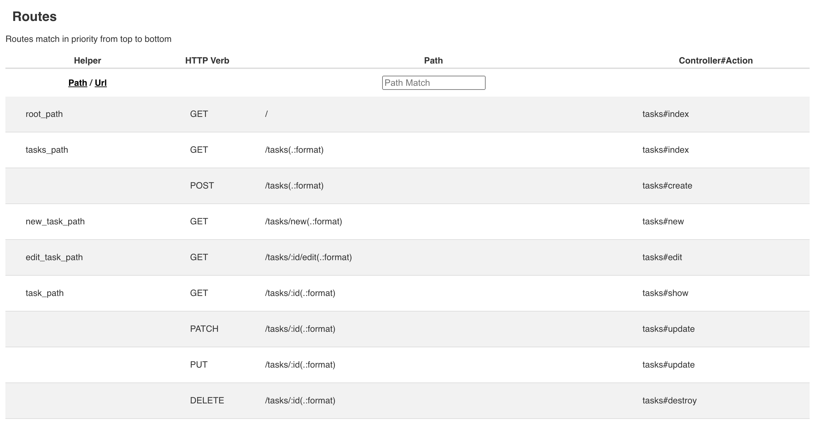

# タスク管理アプリケーションを作ろう

> 参考: 現場で使える Ruby on Rails 5速習実践ガイド Chapter 3 p.81

Chapter3からChapter8にかけて、タスク管理アプリケーションの開発を通してRailsについて学んでいきます。

Chapter3ではCRUD機能を備えたアプリケーションをscaffoldを使わずに実装していきます。実装を通して、Railsの機能や規約について学んでいきます。

また、公式のサポートサイトでは各Chapter完了時点のソースコードがダウンロードできます。
手元で動かない場合などはそちらも参考にしてみてください。

[『現場で使える Ruby on Rails 5速習実践ガイド』サポートサイト | マイナビブックス](https://book.mynavi.jp/supportsite/detail/9784839962227.html)

## アプリケーション作成の準備をしよう

> 参考: 現場で使える Ruby on Rails 5速習実践ガイド Chapter 3-1 p.82

ここでは以下の3つを行います。

- アプリケーションのひな形を作る
- 開発環境のDBを準備する
- view を実装するにあたって利用する gem を導入する

### アプリケーションのひな形を作る

前回と同じく `rails new` コマンドを使ってアプリケーションのひな形を作成します。

> [!IMPORTANT]
> PostgreSQL を使用するために `-d postgresql` を指定してひな型を作成していますが、インストールの過程で以下のようなエラーが表示される場合があります。
> ```
> Installing pg 1.5.6 with native extensions
> Gem::Ext::BuildError: ERROR: Failed to build gem native extension.
> ```
> これはインストールの過程で PostgreSQL のクライアントライブラリが PC にインストールされていない場合に表示されるものです。  
> エラー表示に従って `libpq` を導入して、改めて `bundle install` をすることで解決できます。
 
#### バージョンを指定しない場合

特にバージョンを指定しない場合は、最新バージョンの Rails でセットアップされます。  
Ruby 3.3.0, Rails 7.1.3.2 でも進めることは可能ですが、バージョンの違いによって修正が必要になる場合があります。

```sh
$ rails new taskleaf -d postgresql
```

#### バージョンを指定する場合

バージョンを指定する場合は以下のように `rails new` コマンドを実行してください。  
以下の例は書籍と異なるバージョン Ruby 2.5.1, Rails 5.2.1 を指定している例です。

```sh
$ rbenv shell 2.5.1
$ rails _5.2.1_ new taskleaf -d postgresql --skip-bundle
```

rails のバージョンを固定するため、生成された `taskleaf/Gemfile` の記述を修正します。

before

```
gem 'rails', '~> 5.2.1'
```

after

```
gem 'rails', '5.2.1'
```

修正後、 `bundle install` を実行します。

```sh
$ cd taskleaf
$ bundle install
```

### 開発環境のDBを準備する

書籍内ではMacにインストールしたPostgreSQLを利用していますが、今回はそちらでなく、Dockerコンテナ上のPostgreSQLを利用します。
そのため、`$ bin/rails db:create` を実行する前に DB の準備をしていきます。

このドキュメントと同じ階層にある `docker-compose.yml` を作成したアプリケーション（この場合はtaskleafディレクトリの中）にコピーしてください。
コピーしたら `docker-compose up` を実行してDocker上にDBを立ち上げます。

```sh
$ docker-compose up
```

Docker上のDBに接続するため、RailsアプリケーションのDB接続情報を変更します。 config/database.ymlを編集し、default内にhostやport情報を追記します。

```yaml
default: &default
  adapter: postgresql
  encoding: unicode
  # For details on connection pooling, see Rails configuration guide
  # https://guides.rubyonrails.org/configuring.html#database-pooling
  pool: <%= ENV.fetch("RAILS_MAX_THREADS") { 5 } %>
  host: localhost # <-- 追加
  port: 54321     # <-- 追加
  username: root  # <-- 追加
  password: root  # <-- 追加
  :
  :
```

続いて、動作確認もかねてDB上にデータベースを作成します。

```sh
$ ./bin/rails db:create
```

その後、次のコマンドでPostgreSQLのターミナルへ接続できれば成功です。

```sh
$ ./bin/rails db
Password for user root: # <--- パスワード（今回はroot）を入力する
psql (12.3, server 10.13 (Debian 10.13-1.pgdg90+1))
Type "help" for help.

taskleaf_development=# \l taskleaf*
                                   List of databases
         Name         | Owner | Encoding |  Collate   |   Ctype    | Access privileges
----------------------+-------+----------+------------+------------+-------------------
 taskleaf_development | root  | UTF8     | en_US.utf8 | en_US.utf8 |
 taskleaf_test        | root  | UTF8     | en_US.utf8 | en_US.utf8 |
(2 rows)

taskleaf_development-# \q
```

### Bootstrap

フロントエンドフレームワークのひとつ。  
Rails 6 では npm/yarn + Webpacker を使う方法がありますが、Rails 5 および 7 以降では書籍と同じ bundler 経由の方法で進めることができますので、書籍通り進めてください。

1つ異なる点として、書籍では `bootstrap` と同時に `sassc` がインストールされる前提になっていますが `bootstrap 5.3.3` 時点では同時にインストールされないようなので、実行時に以下のようなエラーが発生してしまいます。

```
bootstrap-rubygem requires a Sass engine. Please add dartsass-sprockets, sassc-rails, dartsass-rails or cssbundling-rails to your dependencies. (LoadError)
```

公式の [README](https://github.com/twbs/bootstrap-rubygem/blob/main/README.md) にしたがって `dartsass-sprockets` (Ruby 2.6 以降, Rails 5 以降に対応) を併せてインストールしてください。

```
gem 'bootstrap', '~> 5.3.3'
gem 'dartsass-sprockets'
```

#### JS の読み込み

書籍内では特に使用する予定はありませんが、navbar の開閉やドロップダウンなどを使用したい場合は importmap-rails を使って読み込むことができます。

1. `config/initializers/assets.rb` の `precompile` に追加
   
   ```diff
   - # Rails.application.config.assets.precompile += %w( admin.js admin.css )
   + Rails.application.config.assets.precompile += %w( bootstrap.min.js popper.js )
   ```
2. `config/importmap.rb` の最終行に追加

   ```ruby
   pin "bootstrap", to: "bootstrap.min.js", preload: true
   pin "@popperjs/core", to: "popper.js", preload: true
   ```
3. `app/javascript/application.js` で Bootstrap と popperjs を読み込み

   ```js
   import "@popperjs/core"
   import "bootstrap"
   ```

> [!TIP]
> 手順 2 はコマンド `bin/importmap pin bootstrap` で行うこともできますが、CDN からダウンロードされる `@popperjs/core` が他のファイルを読み込みに行こうとして 404 でエラーになってしまうので、gem から読み込む方法をおすすめします。

## タスクモデルを作成する

> 参考: 現場で使える Ruby on Rails 5速習実践ガイド Chapter 3-2 p.92

ここではRailsにおける基本的なモデルの作成を行っています。

- `bin/rails generate model` コマンドによるモデル関連ファイルの生成
- マイグレーションによるテーブルの追加

また、Rails の規約についてもいくつか触れられています。

- モデルクラスは単数系（例: `Task`）
- テーブルはモデルクラス名の複数形（例: `tasks`）
- `id`, `created_at`, `updated_at` が自動的に用意される

## コントローラとビュー

> 参考: 現場で使える Ruby on Rails 5速習実践ガイド Chapter 3-3 p.96

CRUDの各画面を作成しながら、コントローラとビューに関連するRailsの基本的な機能について紹介しています。

- `bin/rails generate controller` コマンドによるコントローラ、ビュー、ルーティングの生成
- HTTPリクエストからレスポンスまでのRails内での一連の流れの把握
- Railsのルーティングについての簡単な紹介
- コントローラ内のメソッド（アクション）とビューの紐付けについての規約
- リクエストパラメータについて
- レンダーとリダイレクトについて
- Flashメッセージについて
- パーシャルについて

### ルーティングの確認について

`config/routes.rb` で定義したルーティングを確認するには以下の二通りの方法があります。
どちらも表示される内容は一緒です。

#### `bin/rails routes` コマンドを実行する

```sh
$ bin/rails routes
   Prefix Verb   URI Pattern                 Controller#Action
     root GET    /                           tasks#index
    tasks GET    /tasks(.:format)            tasks#index
          POST   /tasks(.:format)            tasks#create
 new_task GET    /tasks/new(.:format)        tasks#new
edit_task GET    /tasks/:id/edit(.:format)   tasks#edit
     task GET    /tasks/:id(.:format)        tasks#show
          PATCH  /tasks/:id(.:format)        tasks#update
          PUT    /tasks/:id(.:format)        tasks#update
          DELETE /tasks/:id(.:format)        tasks#destroy
...
```

#### `/rails/info/routes` へアクセスする

rails を起動した状態で http://localhost:3000/rails/info/routes にアクセスするとルーティングの定義が表示されます。



## method および confirm について

Chapter 3-3-5 「削除機能を実装する」 において、`link_to` に `method` を指定して DELETE メソッドでリクエストさせるようにしている箇所がありますが、Rails 7 以降ではこの機能 (Rails UJS attributes) が廃止されています。  
その代わりに Turbo という別の機能を使うことで実装できます。

```erb
<%# Rails 6 までの書き方 ( Rails 6 では非推奨 ) %>
<%= link_to '削除', task, method: :delete, data: { confirm: "タスク「#{task.name}」を削除します。よろしいですか？" }, class: 'btn btn-danger' %>
<%# Rails 7 以降の書き方 %>
<%= link_to '削除', task, data: { turbo_method: :delete, turbo_confirm: "タスク「#{task.name}」を削除します。よろしいですか？" }, class: 'btn btn-danger' %>
```

これ以降の箇所においても `method` は `data.turbo_method` に、`data.confirm` は `data.turbo_confirm` に置き換えることで正常に動作するようになります。  
